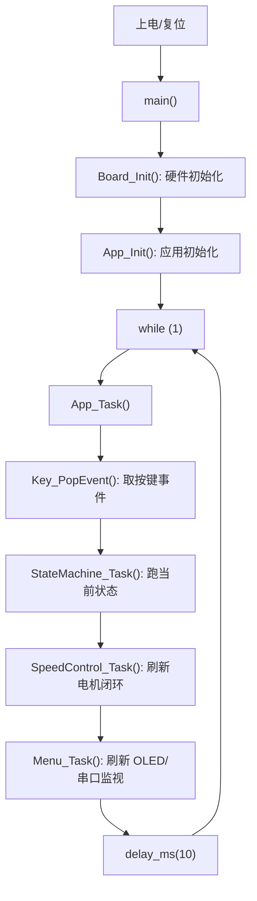

# 00. 先怎么看这个工程

## 一句话总览

这个工程是一个 MSPM0G3507 小车程序：底层负责把 GPIO、ADC、PWM、I2C、UART 等外设初始化好；硬件层把它们包装成“电机、按键、灰度、OLED、编码器、串口模块”；应用层再用这些模块实现菜单、状态机、循迹、速度闭环和路线任务。

你先不要从某一个函数的每一行硬啃。更好的读法是先分层：

```text
generated/   TI/SysConfig 生成的外设初始化代码
config/      项目自己的引脚别名和调参常量
system/      板级初始化、延时、中断分发
hardware/    电机、灰度、OLED、按键、编码器、串口模块
app/         菜单、状态机、循迹、路线、速度闭环
```

## 入口在哪里

正常单片机程序的入口是 `app/main.c` 里的 `main()`。

正常运行形态应该是：

```c
int main(void)
{
    Board_Init();
    App_Init();

    while (1) {
        App_Task();
    }
}
```

含义是：

- `Board_Init()`：把硬件先准备好，比如时钟、GPIO、OLED、PWM、UART、ADC。
- `App_Init()`：把应用层准备好，比如循迹模块、路线模块、速度闭环、菜单、状态机。
- `while (1)`：永远循环。
- `App_Task()`：每轮处理一次按键、状态机、速度控制、OLED 菜单、串口输出。

注意：如果你当前本地看到 `Board_Init()`、`App_Init()`、`App_Task()` 都被注释掉，那就是临时诊断状态。这样下载进去以后主循环是空的，OLED、按键、电机、灰度都不会按完整工程逻辑工作。

## 一张主流程图



## 每层该怎么看

先看 `config/`：

- `pin_map.h`：给生成代码里的长名字起更有意义的别名。
- `board_config.h`：所有调参常量，比如灰度阈值、循迹速度、速度闭环参数。

再看 `system/`：

- `board.c`：上电初始化顺序。
- `interrupt.c`：哪个中断来了，转交给哪个模块处理。
- `delay.c`：毫秒延时。

然后看 `hardware/`：

- `motor.c`：PWM 和方向脚控制 TB6612。
- `gray.c`：7 路灰度 ADC 采样、平均、阈值、循迹误差。
- `oled.c`：I2C 写 OLED、显存、画字。
- `key.c`：PB9/PB8 按键中断变成事件。
- `encoder.c`：编码器 A/B 相中断计数。
- `jy61p.c`：UART0 解析 JY61P 姿态 yaw。
- `jq8400.c`：UART1 给语音模块发数据。
- `link.c`：UART3 调试/Exchange 输出。

最后看 `app/`：

- `app.c`：应用层总调度。
- `menu.c`：OLED 菜单和监视页面。
- `state_machine.c`：整车当前处于菜单、校准、循迹、测试、错误等哪个状态。
- `tracking.c`：把灰度误差变成左右轮速度命令。
- `tracking_exception.c`：丢线、ADC 异常、宽线时怎么处理。
- `motion.c`：给上层一个统一的运动接口。
- `speed_control.c`：用编码器做左右轮 PI 速度闭环。
- `route.c`：直道、入弯、转弯、出弯的路线外环。
- `motor_test.c`：菜单里的电机方向测试。

## 先记住几个单片机概念

外设实例：一个硬件模块本身，比如 `ADC0`、`ADC1`、`UART0`、`I2C0`。它不是传感器数量，而是芯片内部的硬件控制器数量。

通道：外设能接到的某一个输入，比如 ADC 的某个模拟输入通道。

MEM 槽：ADC 转换完成后把结果放到哪个结果寄存器。一个 ADC 外设可以按顺序采多个通道，然后结果分别放进 MEM0、MEM1、MEM2 这类槽里。

GPIO：普通数字输入输出引脚，按键、方向脚、编码器相位都常用 GPIO。

PWM：用定时器输出占空比波形，控制电机驱动板的速度。

UART：串口，JY61P、JQ8400、Exchange 都是 UART。

I2C：两根线 SDA/SCL 的总线，OLED 用它。

中断：硬件事件来了以后 CPU 暂停主循环，先跑一段中断处理函数。比如按键按下、编码器跳变、UART 收到字节。

