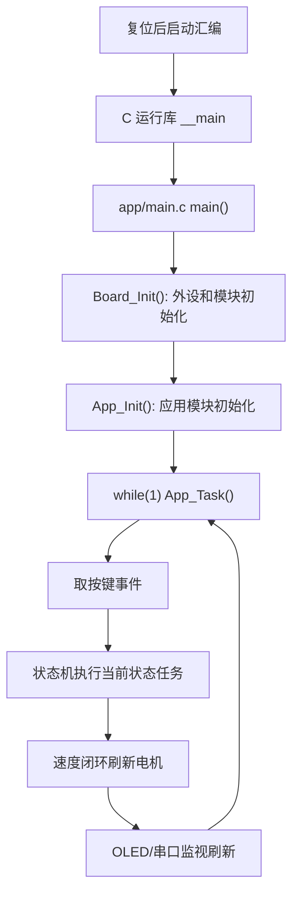

# 00. 推荐源码阅读顺序

## 先别从 main 一路跳到底

单片机工程如果直接从 `main()` 开始一路点进去，很快会跳到 TI DriverLib、寄存器、启动汇编，初学时容易迷路。更适合的顺序是从“地图”到“模块”再到“细节”：

```text
README.md / doc/PINMAP.md
  -> config/
  -> generated/
  -> system/
  -> hardware/
  -> app/
  -> main.c
  -> startup 汇编
```

虽然程序真正从启动汇编和 `main()` 运行，但学习时反过来读会轻松很多。

## 第 1 步：看 README 和引脚图

先读：

- `README.md`
- `doc/PINMAP.md`

你要先知道这辆车接了哪些东西：

```text
OLED       I2C0  PA0/PA1
JY61P      UART0 PA28/PA31
JQ8400     UART1 PB6/PB7
Exchange   UART3 PB2/PB3
电机 PWM   TIMA0 PA7/PA8
电机方向   PB18/PB19/PB20/PB24
灰度 7 路  PA14/PA15/PA16/PA17/PA27/PA24/PA25
编码器     PA12/PA13/PA22/PA23
按键       PB9/PB8
```

不先知道硬件，后面看到 `PIN_KEY_1`、`GRAY_ADC0_MEM_GRAY6` 会很抽象。

## 第 2 步：看 config

读：

- `config/pin_map.h`
- `config/board_config.h`

`pin_map.h` 是“名字翻译表”。它把生成文件里的底层名字翻译成项目自己的名字。

`board_config.h` 是“调参表”。它不负责动作，只保存速度、阈值、PID、路线等参数。

这一步先别纠结每个数值对不对，只要知道：以后调车多数会从这里改。

## 第 3 步：看 generated

读：

- `generated/ti_msp_dl_config.h`
- `generated/ti_msp_dl_config.c`

这两个文件是 TI 底层外设配置。你不需要逐行背，只要看出：

- 哪个外设实例被使用：ADC0、ADC1、I2C0、UART0、UART1、UART3、TIMA0。
- 哪些引脚被配置成 GPIO、ADC、UART、I2C、PWM。
- 每个 `SYSCFG_DL_xxx_init()` 初始化哪类外设。

初学阶段的目标不是会写这类生成代码，而是能看懂上层模块为什么能调用这些外设。

## 第 4 步：看 system

读：

- `system/board.c`
- `system/delay.c`
- `system/interrupt.c`

这一层解决三个问题：

```text
上电后先初始化谁？
怎么延时？
硬件中断来了交给谁？
```

`Board_Init()` 是硬件初始化总管。`interrupt.c` 是中断分发器。

## 第 5 步：看 hardware

先读简单的：

- `hardware/motor.c`
- `hardware/key.c`
- `hardware/encoder.c`
- `hardware/link.c`

再读复杂的：

- `hardware/gray.c`
- `hardware/oled.c`
- `hardware/jy61p.c`
- `hardware/jq8400.c`
- `hardware/oledfont.h`

硬件层的共同特点是：它把“寄存器/DriverLib 调用”包装成人能理解的动作，比如：

```text
Motor_SetSpeed()
Key_PopEvent()
Encoder_GetLeft()
Gray_Update()
OLED_ShowLine()
Link_SendString()
```

## 第 6 步：看 app

先看总调度和状态：

- `app/app.c`
- `app/menu.c`
- `app/state_machine.c`

再看小车怎么动：

- `app/motion.c`
- `app/tracking.c`
- `app/tracking_exception.c`
- `app/route.c`
- `app/speed_control.c`
- `app/motor_test.c`

这一层是“行为逻辑”。它不应该直接纠结寄存器，而是决定当前是菜单、校准、循迹、测试、停止还是错误。

## 第 7 步：最后再回到 main 和 startup

`app/main.c` 很短，它只是把系统接起来：

```c
Board_Init();
App_Init();
while (1) {
    App_Task();
}
```

`MDK-ARM/startup_mspm0g350x_uvision.s` 是芯片复位后的第一段代码。它负责设置栈、放中断向量表，最后跳到 C 运行库的 `__main`，再进入你的 `main()`。

你现在不用写启动汇编，但要知道：中断函数名能被硬件找到，是因为启动文件里的向量表把名字放好了。

## 这份工程的运行主线


