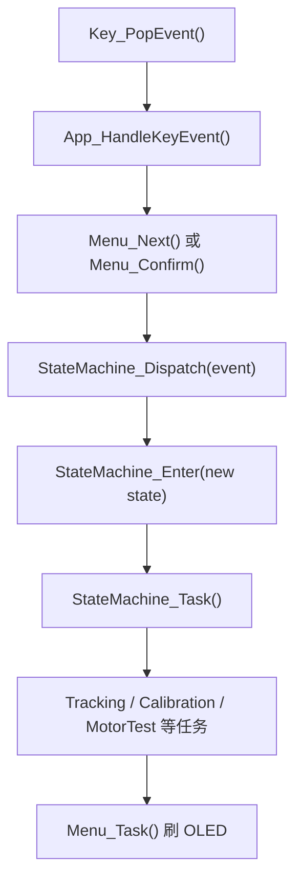

# 05. app 外壳、菜单和状态机

应用层负责“车现在要做什么”。它不应该直接关心某个寄存器怎么配，而是组织硬件模块完成菜单、校准、测试、循迹、停止等行为。

本章文件：

```text
app/main.c
app/app.h
app/app.c
app/menu.h
app/menu.c
app/state_machine.h
app/state_machine.c
```

## app/main.c：程序主入口

正常结构应该很短：

```c
int main(void)
{
    Board_Init();
    App_Init();

    while (1) {
        App_Task();
    }
}
```

这就是单片机主循环模型。

如果你当前本地看到这些调用被注释掉了：

```c
// Board_Init();
// App_Init();
// App_Task();
```

那说明当前代码处于临时诊断/停用状态。这样烧进去以后主循环空转，OLED 菜单、按键处理、灰度采样、电机控制都不会按完整工程逻辑运行。

学习源码时建议先按完整主线理解：

```text
Board_Init -> App_Init -> while(1) App_Task
```

## app.h / app.c：应用总调度

`app.h` 只暴露两个函数：

```c
void App_Init(void);
void App_Task(void);
```

这说明 app 层对 `main.c` 来说非常简单：

```text
初始化一次
循环任务一直跑
```

### App_Init()

`App_Init()` 初始化应用模块：

```c
Tracking_Init();
Route_Init();
SpeedControl_Init();
MotorTest_Init();
Menu_Init();
Link_SendString(...);
StateMachine_Init();
```

顺序含义：

- 循迹异常、路线、速度闭环、电机测试、菜单先准备好。
- 串口输出初始化完成提示。
- 最后状态机进入默认状态，一般是菜单。
- OLED 清屏后显示当前菜单页面。

### App_Task()

主循环每轮执行：

```c
App_HandleKeyEvent(Key_PopEvent());
StateMachine_Task();
SpeedControl_Task();
Menu_Task(StateMachine_GetState());
Link_Task();
delay_ms(CAR_APP_LOOP_DELAY_MS);
```

一轮大概做这些事：

```text
1. 取一次按键事件
2. 当前状态该干什么就干什么
3. 如果不是电机测试状态，刷新速度闭环
4. 刷 OLED 菜单或监视页面
5. 串口后台任务
6. 延时，让主循环不要跑太快
```

### App_HandleKeyEvent()

这个函数把实体按键事件翻译成菜单操作或状态机事件。

在菜单状态：

```text
KEY1 -> Menu_Confirm()，确认当前项
KEY2 -> Menu_Next()，移动到下一项
```

在灰度校准状态：

```text
KEY1 -> 应用校准阈值
KEY2 -> 返回菜单
```

在电机测试状态：

```text
KEY1 -> 下一步电机测试
KEY2 -> 返回菜单
```

这就是为什么按键不是直接控制 OLED，而是经过：

```text
key.c -> app.c -> menu.c/state_machine.c -> OLED 刷新
```

## menu.h / menu.c：OLED 菜单和监视页

`menu.c` 做两件事：

```text
菜单选择
状态监视显示
```

### 菜单页枚举

```c
typedef enum {
    MENU_PAGE_MAIN = 0,
    MENU_PAGE_TEST
} MenuPage;
```

当前有主菜单和测试菜单。

主菜单项：

```text
1.Calib
2.Test
3.Mission
```

测试菜单项：

```text
Motor Dir
Track Only
PID Data
Gray Data
Exchange
Encoder
Back
```

### 菜单状态变量

```c
static MenuPage g_menuPage;
static uint8_t g_mainIndex;
static uint8_t g_testIndex;
static uint8_t g_forceRefresh;
static uint16_t g_refreshTicks;
static uint16_t g_linkPrintTicks;
static CarState g_lastState;
```

这些变量表示：

- 当前在哪个菜单页。
- 当前选中第几个主菜单项。
- 当前选中第几个测试菜单项。
- 是否强制刷新 OLED。
- OLED 刷新计数。
- 串口打印计数。
- 上一轮整车状态，用于检测状态切换。

### 字符串拼接函数

`Menu_AppendText()`、`Menu_AppendUnsigned()`、`Menu_AppendSigned()` 这些函数是在不用 `sprintf` 的情况下手动拼字符串。

为什么不用 `printf/sprintf`？单片机里 `printf` 可能占用较多代码空间和栈，手写简单转换更可控。

### Menu_ShowPaddedLine()

这个函数把一行补到固定长度再显示，避免旧内容残留。

它和 `Board_ShowBootLine()` 的思路一样：

```text
先填空格
再复制文本
最后 OLED_ShowLine()
```

### Menu_Confirm()

它把“当前选中的菜单项”转换成状态机事件。

例如主菜单选中 `1.Calib`：

```c
return CAR_EVENT_GRAY_CALIBRATION_START;
```

测试菜单选中 `Track Only`：

```c
return CAR_EVENT_TRACKING_TEST_START;
```

如果只是从主菜单进入测试菜单，它会改变 `g_menuPage`，但返回 `CAR_EVENT_NONE`，因为整车状态还在菜单里。

### Menu_Task()

这是菜单周期任务。

它会根据当前整车状态决定显示什么：

- 菜单状态显示主菜单或测试菜单。
- 灰度校准状态显示校准提示。
- 循迹状态显示路线阶段、异常状态、速度数据。
- PID 监视显示 KP/KI、实际速度、输出 PWM。
- 灰度监视显示 mask、误差、原始 ADC。
- 编码器监视显示左右计数。

它不是每轮都刷新 OLED，而是根据 `CAR_MENU_REFRESH_TICKS` 控制刷新周期。

## state_machine.h：状态和事件

状态机有两个核心枚举。

### CarState

`CarState` 表示车当前处于哪个模式：

```text
INIT
IDLE
MENU
GRAY_CALIBRATION
TRACKING
TRACKING_TEST
MOTOR_TEST
PID_MONITOR
GRAY_MONITOR
EXCHANGE_MONITOR
ENCODER_MONITOR
MISSION
FINISHED
STOP
ERROR
```

### CarEvent

`CarEvent` 表示外部发生了什么：

```text
START
STOP
MENU
BACK
GRAY_CALIBRATION_START
GRAY_CALIBRATION_APPLY
MOTOR_TEST_NEXT
TRACKING_TEST_START
...
```

状态机的思想是：

```text
不要随便直接改状态
外部只发事件
状态机统一决定能不能切状态
```

## state_machine.c：顶层状态机

核心变量：

```c
static CarState g_carState = CAR_STATE_INIT;
```

### StateMachine_StopMotionModules()

停止所有可能让车动的模块：

```c
Tracking_SetEnabled(0U);
Route_Stop();
MotorTest_Stop();
Motion_Stop();
```

进入菜单、监视、校准、停止、错误等非运行状态时都会调用它。

### Enter 函数

每个状态都有一个进入函数，例如：

```c
StateMachine_EnterMenu()
StateMachine_EnterGrayCalibration()
StateMachine_EnterTracking()
StateMachine_EnterMotorTest()
```

这些函数叫“入口动作”。状态刚切过去时执行一次。

例如进入灰度校准：

```c
Gray_CalibrationReset();
Link_SendString("state: gray calibration\r\n");
```

进入循迹：

```c
Route_Start();
TrackingException_Reset();
Tracking_SetEnabled(1U);
```

### StateMachine_Enter()

这是统一切换状态的函数。

它先判断新旧状态是否一样，如果一样就不重复进入。否则更新 `g_carState`，再根据新状态调用对应的入口动作。

### StateMachine_Dispatch()

这是状态机最重要的公共函数。

外部调用：

```c
StateMachine_Dispatch(event);
```

状态机根据“当前状态 + 事件”决定怎么切。

例如当前是菜单：

```text
START -> TRACKING
GRAY_CALIBRATION_START -> GRAY_CALIBRATION
MOTOR_TEST_NEXT -> MOTOR_TEST
TRACKING_TEST_START -> TRACKING_TEST
```

当前是电机测试：

```text
MOTOR_TEST_NEXT -> 下一步测试，结束则回菜单
BACK -> 菜单
```

当前是运行/监视/任务状态：

```text
BACK -> 菜单
TRACKING_DONE -> FINISHED
```

### StateMachine_Task()

这是每轮主循环调用的状态任务。

它根据当前状态执行对应周期任务：

```text
GRAY_CALIBRATION -> Gray_CalibrationSample()
TRACKING -> Route_Task() + Tracking_Task()
TRACKING_TEST -> Tracking_Task()
MOTOR_TEST -> MotorTest_Task()
其他监视状态 -> 多数由 Menu_Task() 显示数据
```

状态机只决定“现在跑哪个任务”，具体怎么跑交给对应模块。

## app 层主关系



