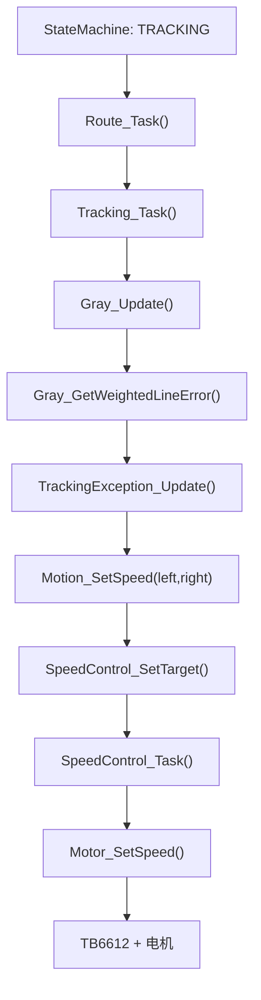

# 06. app 运动、循迹、路线、速度闭环和电机测试

这一章讲小车“怎么动”。它把灰度、编码器、JY61P、电机这些硬件模块串起来。

本章文件：

```text
app/motion.h
app/motion.c
app/tracking.h
app/tracking.c
app/tracking_exception.h
app/tracking_exception.c
app/route.h
app/route.c
app/speed_control.h
app/speed_control.c
app/motor_test.h
app/motor_test.c
```

## motion.h / motion.c：运动统一入口

`motion.c` 是上层和电机之间的一层封装。

为什么需要它？因为项目可以选择：

```text
开环：直接 Motor_SetSpeed()
闭环：先 SpeedControl_SetTarget()，再由 SpeedControl_Task() 控制电机
```

上层循迹不需要知道当前是哪种模式，只调用：

```c
Motion_SetSpeed(left, right);
```

### Motion_Stop()

```c
#if CAR_ENABLE_SPEED_CONTROL
    SpeedControl_Stop();
#else
    Motor_Stop();
#endif
```

如果启用速度闭环，停车要清目标、清积分、停电机。如果不开闭环，直接停电机。

### Motion_SetSpeed()

同理：

```c
#if CAR_ENABLE_SPEED_CONTROL
    SpeedControl_SetTarget(left, right);
#else
    Motor_SetSpeed(left, right);
#endif
```

这就是条件编译。`CAR_ENABLE_SPEED_CONTROL` 在 `board_config.h` 里。

### Motion_Forward() / Backward() / TurnLeft() / TurnRight()

这些是更高层动作封装：

```text
Forward：左右同正
Backward：左右同负
TurnLeft：左负右正
TurnRight：左正右负
```

正式循迹目前更多是直接给左右轮速度命令。

## tracking.h / tracking.c：循迹主逻辑

核心变量：

```c
static uint8_t g_trackingEnabled;
```

如果没启用循迹，`Tracking_Task()` 直接返回。

### Tracking_Init()

初始化循迹使能标志，并初始化异常处理器：

```c
g_trackingEnabled = 0U;
TrackingException_Init();
```

### Tracking_SetEnabled()

启用或关闭循迹。

关闭时会：

```c
Motion_Stop();
```

避免状态切出循迹后车还继续跑。

### Tracking_Task()

这是循迹主任务，流程：

```text
1. 如果未启用，返回
2. 从 route 获取 baseDuty 和 turnLimit
3. Gray_Update() 更新灰度
4. 如果采样成功且看到线，计算加权误差
5. 调 TrackingException_Update()
6. 如果异常处理要求停车，Motion_Stop()
7. 否则 Motion_SetSpeed(leftDuty, rightDuty)
```

注意：`tracking.c` 自己不直接算所有异常，它把异常交给 `tracking_exception.c`。

## tracking_exception.h / tracking_exception.c：循迹异常处理

这个模块处理：

```text
正常循迹
宽线/路口
短暂丢线保持
丢线后搜线
ADC 采样失败
搜线失败停车
```

### 状态枚举

```text
NORMAL
WIDE_LINE
LOST_HOLD
LOST_SEARCH_LEFT
LOST_SEARCH_RIGHT
ADC_FAULT
LOST_STOP
```

这些状态会显示到 OLED 循迹页面，方便调试。

### 保存上一拍命令

```c
static int16_t g_lastLeftDuty;
static int16_t g_lastRightDuty;
static uint8_t g_hasLastCommand;
```

丢线刚发生时，不会立刻停车，而是先保持上一拍输出几轮。这样遇到短缺口或传感器瞬间抖动，不会马上停。

### 记住上次线在哪边

```c
static int8_t g_lastLineSide;
```

如果上次误差为负，说明线偏左；丢线后优先向左搜。上次误差为正，则优先向右搜。

### TrackingException_BuildNormalCommand()

正常循迹时，把线误差转换成左右轮命令：

```c
correction = lineError * CAR_TRACK_TURN_GAIN / GRAY_LINE_ERROR_SCALE;
leftDuty = baseDuty + correction;
rightDuty = baseDuty - correction;
```

例如线偏右，`lineError > 0`：

```text
左轮加速
右轮减速
车往右修
```

### TrackingException_HandleLostLine()

如果灰度 mask 为 0，说明没有任何一路压线。

处理顺序：

```text
先 LOST_HOLD：保持上一拍命令几轮
再 LOST_SEARCH_LEFT/RIGHT：温和差速搜线
最后 LOST_STOP：搜线超时停车
```

是否最终停车由 `CAR_TRACK_LOST_STOP` 控制。

### TrackingException_HandleAdcFault()

如果 `Gray_Update()` 失败，说明 ADC 采样异常。连续失败达到 `CAR_TRACK_ADC_FAULT_STOP_TICKS` 后，会要求停车。

这是防止传感器数据完全不可信时车还继续跑。

## route.h / route.c：路线外环

路线外环解决的问题不是“线在哪”，而是“现在处于赛道哪个阶段”。

阶段：

```text
IDLE
STRAIGHT
APPROACH_CORNER
TURNING
EXIT_CORNER
```

### RouteProfile

```c
typedef struct {
    uint16_t targetBaseDuty;
    uint16_t currentBaseDuty;
    uint16_t targetTurnLimit;
    uint16_t currentTurnLimit;
} RouteProfile;
```

路线层给循迹层两个参数：

```text
baseDuty：当前基础速度
turnLimit：当前最大转向修正
```

为什么有 target 和 current？因为从高速切低速不要一下子跳变，而是平滑靠近。

### Route_Start()

初始化路线并进入直道：

```c
Route_Init();
g_routeRunning = 1U;
Route_EnterStage(ROUTE_STAGE_STRAIGHT);
```

### Route_Task()

每轮更新路线阶段。

直道阶段：

```text
如果编码器相对路程 >= APPROACH_TICKS
进入 APPROACH_CORNER
```

接近拐角：

```text
如果路程 >= EDGE_TICKS
进入 TURNING
```

转弯阶段：

```text
如果 JY61P 有 yaw，用 yaw 判断是否转够 90 度
如果没有 yaw，用固定 tick 时间兜底
```

出弯阶段：

```text
保持一段时间后回到 STRAIGHT
```

路线层不直接控制电机。它只影响 `Tracking_Task()` 使用的基础速度和转向限幅。

## speed_control.h / speed_control.c：编码器 PI 速度闭环

速度闭环让左右轮尽量按目标速度走，而不是只给固定 PWM。

### SpeedControlWheel

```c
typedef struct {
    int16_t targetCommand;
    int16_t currentCommand;
    int32_t lastCount;
    int32_t integral;
    int16_t actualTicks;
    int16_t outputPwm;
    int8_t encoderSign;
} SpeedControlWheel;
```

每个轮子一份状态：

- `targetCommand`：上层想要的目标命令。
- `currentCommand`：当前平滑后的命令。
- `lastCount`：上次编码器累计计数。
- `integral`：积分项。
- `actualTicks`：当前控制周期实际走了多少 tick。
- `outputPwm`：最终输出给电机的 PWM 命令。
- `encoderSign`：编码器方向修正。

### SpeedControl_SetTarget()

上层调用 `Motion_SetSpeed(left, right)` 后，如果启用了闭环，就会进入这里，设置左右轮目标。

### SpeedControl_Task()

不是每一轮 App_Task 都更新闭环，而是累计到 `CAR_SPEED_CONTROL_PERIOD_TICKS` 后才更新一次。

更新流程：

```text
读取编码器
计算本周期实际 tick
目标命令换算成目标 tick
误差 = 目标 tick - 实际 tick
积分累加并限幅
output = 当前命令 + KP*误差 + KI*积分
输出限幅
低速时保证最小有效 PWM
Motor_SetSpeed(output)
```

### 为什么有最小有效 PWM

电机低速时有死区。PWM 太小，电机可能嗡嗡响但不动。所以如果目标非零、输出非零，但低于 `CAR_SPEED_MIN_ACTIVE_DUTY`，代码会把它抬到最小有效值。

## motor_test.h / motor_test.c：电机方向测试

这个模块用于菜单里的 `Motor Dir`。

测试步骤：

```text
LEFT_FORWARD
LEFT_REVERSE
RIGHT_FORWARD
RIGHT_REVERSE
BOTH_FORWARD
BOTH_REVERSE
DONE
```

### MotorTest_Start()

从左电机正转开始。

### MotorTest_Next()

每按一次 KEY1，进入下一步。如果已经测试完，就停车并回菜单。

### MotorTest_Task()

每个测试步骤只运行固定时间：

```c
CAR_MOTOR_TEST_RUN_TICKS
```

计时到 0 自动 `Motor_Stop()`。这样即使你忘了按返回，电机也不会一直转。

## 运动控制总链路

正式循迹时大概是：



